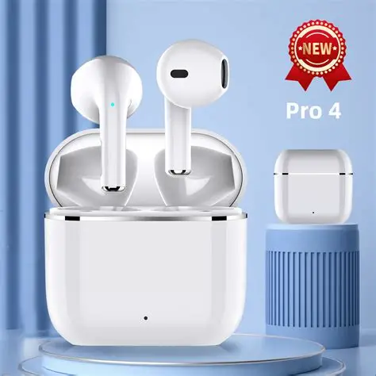
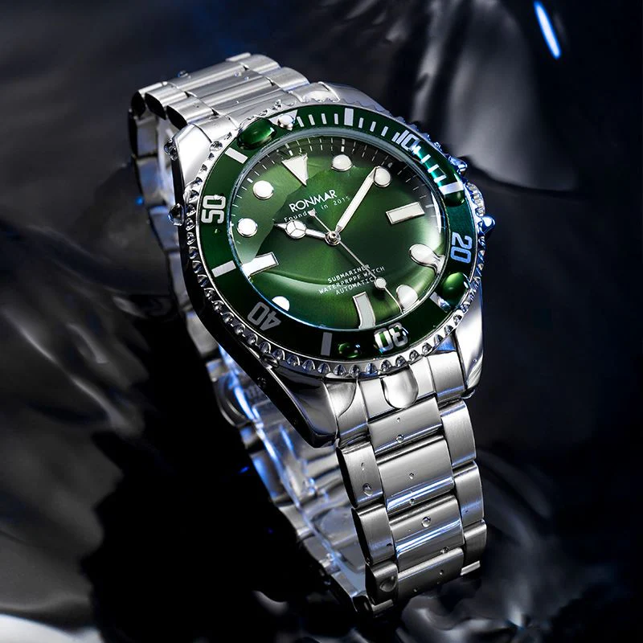

# WordPress-website
<!DOCTYPE html>
<html lang="en">

<head>
    <meta charset="UTF-8">
    <meta name="viewport" content="width=device-width, initial-scale=1.0">
    <title>ApnaStore - The Everything Store</title>

    <!-- Tailwind CSS CDN -->
    

    <!-- Google Fonts: Inter -->
    <link rel="preconnect" href="https://fonts.googleapis.com">
    <link rel="preconnect" href="https://fonts.gstatic.com" crossorigin>
    <link href="https://fonts.googleapis.com/css2?family=Inter:wght@400;500;600;700&display=swap" rel="stylesheet">

    <!-- Font Awesome for Icons -->
    <link rel="stylesheet" href="https://cdnjs.cloudflare.com/ajax/libs/font-awesome/6.5.1/css/all.min.css">

    <!-- Custom Styles -->
    
</head>

<body class="bg-gray-200">

    <!-- Header Section -->
    <header class="bg-gray-900 text-white sticky top-0 z-50">
        <!-- Top Nav -->
        

            <a href="#" class="text-3xl font-bold" onclick="showPage('home')">ApnaStore</a>
            

                <input type="text" placeholder="Search ApnaStore..."
                    class="w-full px-4 py-2 rounded-l-md text-gray-800 focus:outline-none">
                <button class="bg-orange-400 hover:bg-orange-500 text-white px-5 rounded-r-md"><i
                        class="fa fa-search"></i></button>
            

            

                
<button class="flex items-center space-x-1 hover:text-orange-400"><i
                            class="fa fa-globe text-xl"></i>EN<i
                            class="fa fa-caret-down text-xs"></i></button>
                    <ul
                        class="dropdown-menu absolute hidden bg-white text-gray-800 rounded-md shadow-lg mt-2 py-1 w-32 right-0">
                        <li><a href="#" class="block px-4 py-2 text-sm hover:bg-gray-100">English</a></li>
                        <li><a href="#" class="block px-4 py-2 text-sm hover:bg-gray-100">اردو</a></li>
                    </ul>
                

                <button id="signInBtn" class="hover:text-orange-400">
                    
Hello, sign in

                    
Account & Lists <i
                            class="fa fa-caret-down text-xs ml-1"></i>

                </button>
                <a href="#" class="hidden sm:block hover:text-orange-400">
                    
Returns

                    
& Orders

                </a>
                <a href="#" class="relative flex items-end hover:text-orange-400"><i
                        class="fa fa-shopping-cart text-3xl"></i>3Cart</a>
                <button id="mobile-menu-button" class="md:hidden text-white focus:outline-none ml-2"><i
                        class="fa fa-bars text-xl"></i></button>
            

        

        <!-- Bottom Nav -->
        <nav class="bg-gray-800 text-white">
            

                <a href="#" class="font-semibold hover:text-orange-400" onclick="showPage('home')">Home</a>
                <a href="#" class="font-semibold hover:text-orange-400" onclick="showPage('shop')">Today's Deals</a>
                <a href="#" class="font-semibold hover:text-orange-400" onclick="showPage('contact')">Customer
                    Service</a>
                <a href="#" class="font-semibold hover:text-orange-400" onclick="showPage('messages')">Messages</a>
                <a href="#" class="font-semibold hover:text-orange-400" onclick="showPage('giftcards')">Gift Cards</a>
                <a href="#" class="font-semibold hover:text-orange-400" onclick="showPage('sell')">Sell</a>
            

        </nav>
        

    </header>

    <main>
        <!-- Home Page -->
        

            <!-- Image Slider -->
            

                

                    
                    

                        <h2>Discover Cutting-Edge Gadgets</h2>
                        
Shop the newest phones, laptops, and accessories.

                    

                

                

                    
                    

                        <h2>Upgrade Your Wardrobe</h2>
                        
Find the latest trends in clothing for all seasons.

                    

                

                

                    
                    

                        <h2>Transform Your Living Space</h2>
                        
Explore stylish furniture and home decor.

                    

                

                <a class="prev">&#10094;</a>
                <a class="next">&#10095;</a>
            

            

            <!-- Product Grid -->
            

                <h2 class="text-3xl font-bold text-center text-gray-800 mb-10">Top Picks for You</h2>
                

                    <!-- Product 1: Kitchen Knife -->
                    

                        
                        

                            <h3 class="text-lg font-semibold text-gray-800 mb-2">6 Inch Kitchen Knife</h3>
                            
PKR 7,899

                            

                                <button
                                    class="w-full mt-4 bg-gray-800 text-white py-2 rounded-lg hover:bg-orange-500">Add
                                    to Cart</button>
                            

                        

                    

                    <!-- Product 2: Wooden Cutting Board -->
                    

                        
                        

                            <h3 class="text-lg font-semibold text-gray-800 mb-2">Wooden Cutting Board</h3>
                            
PKR 4,499

                            

                                <button
                                    class="w-full mt-4 bg-gray-800 text-white py-2 rounded-lg hover:bg-orange-500">Add
                                    to Cart</button>
                            

                        

                    

                    <!-- Product 3: Non-Stick Frying Pan -->
                    

                        
                        

                            <h3 class="text-lg font-semibold text-gray-800 mb-2">Non-Stick Frying Pan</h3>
                            
PKR 9,120

                            

                                <button
                                    class="w-full mt-4 bg-gray-800 text-white py-2 rounded-lg hover:bg-orange-500">Add
                                    to Cart</button>
                            

                        

                    

                    <!-- Product 4: Measuring Spoon Set -->
                    

                        
                        

                            <h3 class="text-lg font-semibold text-gray-800 mb-2">Measuring Spoon Set</h3>
                            
PKR 2,750

                            

                                <button
                                    class="w-full mt-4 bg-gray-800 text-white py-2 rounded-lg hover:bg-orange-500">Add
                                    to Cart</button>
                            

                        

                    

                

            

        

        <!-- Today's Deals Page -->
        

            

                <h1 class="text-4xl font-bold text-gray-800 mb-8 text-center">Today's Deals</h1>
                

                    <!-- Deal 1 -->
                    

                        30% OFF
                        
                        

                            <h3 class="text-lg font-semibold text-gray-800 mb-2">Wireless Earbuds Pro</h3>
                            

                                
PKR 4,999

                                
PKR 7,142

                            

                            
Save PKR 2,143

                            

                                <button
                                    class="w-full mt-4 bg-gray-800 text-white py-2 rounded-lg hover:bg-orange-500">Add
                                    to Cart</button>
                            

                        

                    

                    <!-- Deal 2 -->
                    

                        50% OFF
                        
                        

                            <h3 class="text-lg font-semibold text-gray-800 mb-2">Smart Watch Series 5</h3>
                            

                                
PKR 8,999

                                
PKR 17,999

                            

                            
Save PKR 9,000

                            

                                <button
                                    class="w-full mt-4 bg-gray-800 text-white py-2 rounded-lg hover:bg-orange-500">Add
                                    to Cart</button>
                            

                        

                    

                    <!-- Deal 3 -->
                    

                        25% OFF
                        
                        

                            <h3 class="text-lg font-semibold text-gray-800 mb-2">3-in-1 Blender</h3>
                            

                                
PKR 5,625

                                
PKR 7,500

                            

                            
Save PKR 1,875

                            

                                <button
                                    class="w-full mt-4 bg-gray-800 text-white py-2 rounded-lg hover:bg-orange-500">Add
                                    to Cart</button>
                            

                        

                    

                    <!-- Deal 4 -->
                    

                        40% OFF
                        
                        

                            <h3 class="text-lg font-semibold text-gray-800 mb-2">Premium Travel Backpack</h3>
                            

                                
PKR 3,600

                                
PKR 6,000

                            

                            
Save PKR 2,400

                            

                                <button
                                    class="w-full mt-4 bg-gray-800 text-white py-2 rounded-lg hover:bg-orange-500">Add
                                    to Cart</button>
                            

                        

                    

                

            

        

        <!-- Categories Page -->
        

            

                <h1 class="text-4xl font-bold text-gray-800 mb-8 text-center">Categories</h1>
                
Categories page content goes here.

            

        

        <!-- About Page -->
        

            

                <h1 class="text-4xl font-bold text-gray-800 mb-6 text-center">About Us</h1>
                

                    
'ApnaStore' was launched in 2024 with the mission
                        to provide high-quality products at affordable prices to customers across Pakistan. We leverage
                        technology and superior customer service to make your online shopping experience easy and
                        enjoyable.

                

            

        

        <!-- Contact Page -->
        

            

                <h1 class="text-4xl font-bold text-gray-800 mb-8 text-center">Customer Service</h1>
                

                    <form>
                        
<label for="name"
                                class="block text-gray-700 font-semibold mb-2">Name</label><input type="text" id="name"
                                class="w-full px-4 py-2 border rounded-lg focus:outline-none focus:ring-2 focus:ring-orange-500">
                        

                        
<label for="email"
                                class="block text-gray-700 font-semibold mb-2">Email</label><input type="email"
                                id="email"
                                class="w-full px-4 py-2 border rounded-lg focus:outline-none focus:ring-2 focus:ring-orange-500">
                        

                        
<label for="message"
                                class="block text-gray-700 font-semibold mb-2">Message</label><textar
